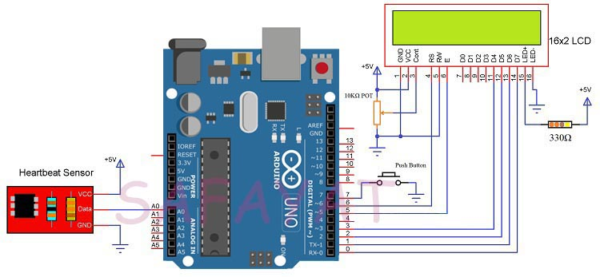

# heartbeat-monitor
# Introduction :
Heartbeat Sensor is an electronic device that is used to measure the heart rate. Monitoring heart rate is very important for athletes, patients as it determines the condition of the heart. An easy way to monitor the heart rate is to use a Heartbeat Sensor. The heartbeat is measured in beats per minute or bpm, which indicates the number of times the heart is contracting or expanding in a minute. 
# Principle of Heartbeat Sensor : 
The principle behind the working of the Heartbeat Sensor is Photoplethysmograph. According to this principle, the changes in the volume of blood in an organ is measured by the changes in the intensity of the light passing through that organ. Usually, the source of light in a heartbeat sensor would be an IR LED and the detector would be any Photo Detector like a Photo Diode, an LDR  or a Photo Transistor. 
# Apparatus : 
* Arduino Uno
* HC-SRO4 Ultrasonic Sensor
* LCD Display 16*2
* Heartbeat Sensor Module with Probe (finger based) 
* Potentiometer 
* Resistors
* Push Button
* Jumper Wires
# Schematics : 

# Code : 
[Code Link](Heartbeat_monitor.ino)
# Working principle : 
A simple Heartbeat Sensor consists of a sensor and a control circuit. The sensor part of the Heartbeat Sensor consists of an IR LED and a Photo Diode placed in a clip.The Control Circuit consists of an Op-Amp IC and few other components that help in connecting the signal to a Microcontroller. Every heartbeat will alter the amount of blood in the finger and the light from the IR LED passing through the finger and thus detected by the Photo Diode will also vary
# Application : 
* This device can calculate the heart rate of a person.
* It can be used as an inexpensive alternative to Smart Watches and other expensive Heart Rate Monitors.